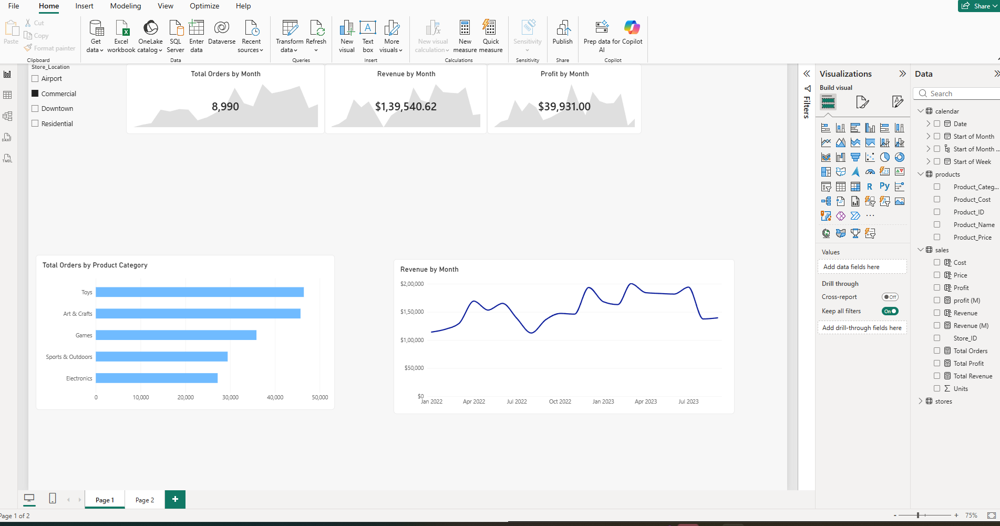

# Maven_Toys_Power_BI_Dashboard
Interactive Power BI dashboard analysing Maven Toys sales, revenue, profit, product categories, store locations, and monthly performance using DAX and data modelling.
# Maven Toys Business KPI Dashboard – Power BI

## Project Overview

This project is an interactive Business KPI Dashboard created in Microsoft Power BI
using the Maven Toys retail sales dataset.

The purpose of the project is to analyse sales performance and provide an easy-to-use
dashboard for monitoring key business metrics such as total orders, revenue, profit,
monthly trends, product category performance, and store location performance.

This project was created as part of my practical Power BI and Data Analytics learning.

## Dashboard Preview

## Key Features

- KPI cards for Total Orders, Revenue, and Profit
- Monthly trend analysis for Orders, Revenue, and Profit
- Revenue trend visualisation
- Product category performance analysis
- Store location filtering
- Interactive filtering and cross-filtering
- Data model with relationships between sales, products, stores, and calendar tables

## Data Model

The Power BI model contains four main tables:

- **sales** – Fact table containing transactional sales data
- **products** – Product information including category, cost, price, and product name
- **stores** – Store information including city, location, store name, and opening date
- **calendar** – Date dimension used for time-based analysis

The model uses one-to-many relationships between the dimension tables and the sales
fact table.

## Data Model

## Data Transformation

Power Query was used to prepare the data before analysis.

The preparation included:

- Checking and correcting data types
- Preparing date fields
- Formatting price and cost fields
- Validating product and store identifiers
- Preparing tables for the data model

## Measures & Calculations

Measures were created in Power BI to analyse key business metrics, including:

- Total Orders
- Total Revenue
- Total Profit
- Revenue
- Profit
- Cost
- Units Sold

These measures are used throughout the dashboard to provide dynamic KPI calculations
based on the selected filters.

## Dashboard Analysis

### Monthly Performance

The dashboard tracks revenue over time, allowing monthly sales patterns and changes
in business performance to be identified.

### Product Category Performance

Orders are compared across product categories including:

- Toys
- Art & Crafts
- Games
- Sports & Outdoors
- Electronics

### Store Location Analysis

The dashboard includes an interactive Store Location slicer that allows users to
analyse performance across:

- Airport
- Commercial
- Downtown
- Residential

Selecting a location dynamically updates the dashboard KPIs and visualisations.

## Tools Used

- Microsoft Power BI Desktop
- Power Query
- DAX
- Data Modelling
- Data Visualisation
- GitHub

## Skills Demonstrated

This project demonstrates practical experience in:

- Data cleaning and transformation
- Data modelling
- Creating table relationships
- DAX measures
- KPI development
- Interactive dashboard development
- Business data analysis
- Data visualisation
- Communicating insights through dashboards

## Project Files

- `Maven-Toys-Business-KPI-Dashboard.pbix` – Complete Power BI project
- `images/dashboard.png` – Dashboard preview
- `images/data-model.png` – Power BI data model

## Dataset

The project uses the Maven Toys retail dataset for educational and portfolio purposes.

## Author

**Gayatri Addala**

Power BI / Data Analytics Portfolio Project
